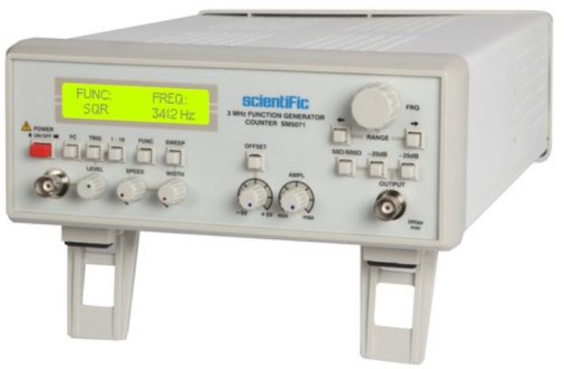

# Theory:

## Function Generator:
  Function Generator is an instrument that can generate common waveforms like triangle, sine, cosine, square, sawtooth, etc., It also provides options for changing the characteristics of the waveforms such as amplitude and frequency. The wave generated is available at the output jack. It can be visualised by connecting it to the CRO.

    

  citation : image of function generator taken from tradeindia.

## Cathode Ray Oscilloscope - CRO:
  CRO which stands for Cathode Ray Oscilloscope is an electronic instrument used to visualize waveforms. In the early days, it is also called an oscillograph. The instrument has four sections namely display, x-axis controls, y-axis controls and triggers.
	CRO is mainly used to analyse the properties of the waveforms  

  

      
  

  citation : image of cro taken from amazon.in.

## Sine wave:
Sine wave is a periodic wave defined by the function.
*y = sin(x)*

    

## Cosine wave:
Cosine wave is also a periodic wave defined by a function.
*y=cos(x)*

    

## Square wave:
Square wave also called pulse wave is a periodic waveform having an equal positive and negative pulse width.
generally called as 50% duty cycle.

    

## Sawtooth wave:
  The sawtooth wave is in a way of the non-sinusoidal waveform. The shape of the wave resembles the teeth of a saw so it is named as sawtooth wave. The sawtooth waveform ramps upward and then drops sharply. But, in a "reverse sawtooth wave", the wave goes downward and then sharply rises. It can also be viewed as the extreme case of an asymmetric triangle wave. The piecewise linear function based on the floor function of time t is an instance of a sawtooth wave with period 1. A more general form, in the range from −1 to 1, and having period a, is This sawtooth function has the same phase as the sine function.

  

      
  

## Triangular wave:
Triangular waves have a triangular shape which is a periodic and non-sinusoidal waveform. Time and again people get confused between the triangle and sawtooth waves. The distinguishing feature of a triangular wave is that it has equal rise and fall times. To generate a triangular waveform we need an input wave, we are using square waves for input. Similar to the triangular waves, square waves have equal rise and fall times so they are more suitable to be converted to a triangular waveform. The triangle waveform increases gradually along a straight line to its maximum value, and then gradually decreases along a straight line to its lowest value, and then starts increasing again.
By repeatedly charging and discharging a capacitor from a constant current source, the triangular wave is generated. Therefore it produces a linearly ascending and descending voltage ramp.

    

