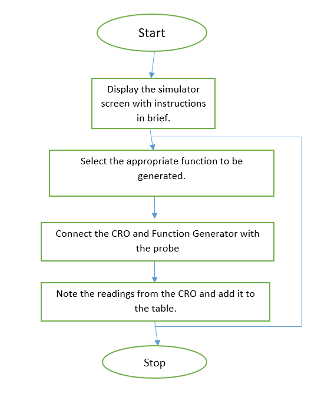
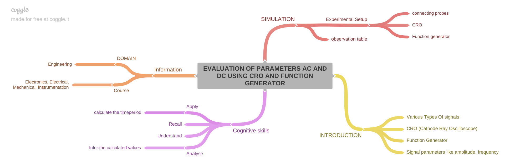
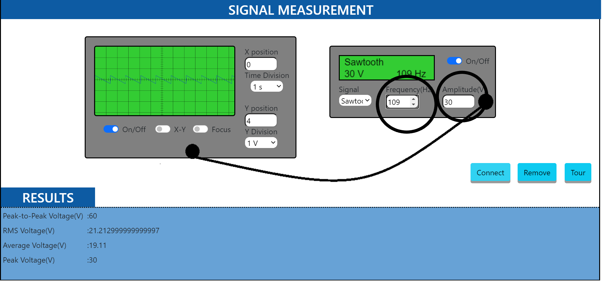

# Round 2

### 1.Story Outline

#### Signal Measurement And Analysis:
Information or data in the form of signals,marks the origin of any communication system,that necessitates the transfer of this data from source to destination.Signal can take various forms and hence the processing.We are in need to measure the signal using the parameters defined and analyse them in order to proceed with further processing.

### 2.Story

The story should cover some key points, they are:

#### Visual stage description:
Setup consists of a function generator as signal source which generates signal of various forms whose frequency and amplitude could be varied to have a thorough analysis of every type of signal.The same could be connected to Cathode ray oscilloscope to view,measure and analyse the signal parameters

#### User Objectives and Goals:

 - State the definition and sense of signal
 - Familiarise with the front panel details of function Generator,Cathode ray oscilloscope and Regulated power supply.
 - Recall signal parameters like Amplitude,frequency,time period,peak to peak value.
 - Measure the parameters from the display study its behaviour
 - Analyse the signal for varied frequency and/or amplitude conditions for varied functions.
 - Model a system based on design equations and construct the same
 - Measure the input and output to a system and work out a relation between the two.
 - Verify whether the system works as per the design.

#### Pathway Activities - Experiment 1:

 - Connecting probe is also included to enable connection between the equipment. Power supply also provided to power up the equipment.
 - The front panel of the equipment are opened up. Function selection keys are used to select various functions. Frequency and amplitude of the signal could be varied using suitable provisions, that are assigned.
 - The connections are made and front panel adjustments are familiarised.
 - The displayed waveform is adjusted suitably to have comfortable measurements.
 - The various signal parameters like amplitude, time period, frequency, Peak to peak voltage is measured and displayed.
 - Observations are noted down and the output is studied.

#### Set Challenges / Questions / Complexity / Variations
1. How is the waveform adjusted?

	a. by adjusting the voltage
	b. **through shift controls**
	c. by reducing the current
	d. by means of a galvanometer

2. How is error in measurement reduced?

	a. using r.m.s value
	b. using absolute value
	c. **using peak to peak value**
	d. using a voltmeter

3. Which of the following relation represents the time period of a waveform?

	a. T = number of divisions occupied by 1 cycle×(time)
	b. T = number of divisions occupied by 1 cycle×(1⁄division)
	c. **T = number of divisions occupied by 1 cycle×(time⁄division)**
	d. T = number of divisions occupied by 1 cycle

4. How is frequency related to time period?

	a. square proportional
	b. not related
	c. directly proportional
	d. **inversely proportional**

5. In Real time sampling, bandwidth is limited.

	a. **True**
	b. False

6. An oscilloscope with frequency 20 to 50 GHz will need a slow speed.

	a. True
	b. **False**

7. In a digital storage oscilloscope, how many types of acquisition methods are present ?

	a. **3**
	b. 6
	c. 2
	d. 4

8. CRO can be used to measure ___________

	a. Frequency
	b. AC Voltage
	c. DC Voltage
	d. **All of the above**

9. Which of the following parameter cannot be measured directly using a CRO?

	a. Frequency
	b. **Power**
	c. Current
	d. Voltage

10. Square wave and pulse wave are same in all aspects

	a. True
	b. **False**

11. In function generator, the function selector is used to select the desired

	a. Frequency
	b. **Waveform**
	c. Amplitude
	d. Voltage

12. The selected waveform in a function generator is available at

	a. VCO output
	b. **Output Jack**
	c. Function selector

#### Allow Pitfalls: NA

#### Equations and Fomulas:
- **Period of a waveform is obtained by:**
- T = number of divisions occupied by 1 cycle×( time ⁄ division )
- **Peak-to-peak Value** = 2 × Peak Value  

- **RMS value is obtained by:**
1.Sine wave RMS value = Peak Value / √2
2.Cosine wave RMS value = Peak Value / √2
3.Square wave RMS value = Peak Value  
4.Sawtooth wave RMS value = Peak Value / √3
5.Triangular wave RMS value = Peak Value / √3

- **The Average value is obtained by:**
1.Sine wave average value = 2 × Peak Value / π
2.Cosine wave average value = 2 × Peak Value / π
3.Square wave average value = Peak Value  
4.Sawtooth wave average value = Peak Value / 2
5.Triangular wave average value = Peak Value / 2

#### 3.Flowchart:

  

#### 4.Mindmap:

  

#### 5.Storyboard - Experiment 1

- Click on the Function Generator module and front panel opens up
- Switch ON the CRO and function generator using POWER button.
- Connect the function generator and the CRO with probe.

  

-	Select the required function using the function generator.

  

- 	Set the amplitude and frequency of that function using the function generator.

  

-	Set the required switches in the CRO appropriately to display the waveform.

-	Observe the waveform displayed in the CRO and calculated the AC/DC signal parameters and verify with the result displayed.

  

#### Conclusion
Time required to perform the virtual experiment.
It will take 5 mins approximately to understand the procedure to perform the experiment. To generate data will take another 5 min. Calculating and entering the values of various entities in the Result table will take approximately 5 min. It will take about 5 mins to answer the assessment questions. Thus, the total time required to perform the experiment will require around 20 min.
